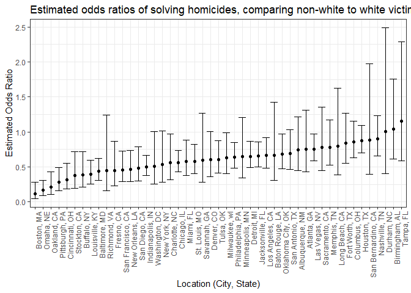

P8105 Homework 6
================
Adina Zhang

Problem 1. **Washington Post** Dataset
--------------------------------------

#### Load and clean dataset

``` r
# Pull dataset from web and convert it to readable format in R
# Create city_state variable that combines city and state
# Omit cities that don't report victim race
# Create binary variable to classify homicides solved and unsolved
# Recode victim_race to white vs. non-white
# Convert victim_age into a numeric
homicide_df = read_csv(url("https://raw.githubusercontent.com/washingtonpost/data-homicides/master/homicide-data.csv")) %>% 
  unite(city_state, city:state, sep = ", ") %>% 
  filter(!city_state %in% c("Dallas, TX", "Phoenix, AZ", "Kansas City, MO", "Tulsa, AL")) %>%
  mutate(resolved = as.numeric(disposition == "Closed by arrest"),
         victim_race = as.factor(if_else(victim_race == "White", "White", "Non-white")),
         victim_race = fct_relevel(victim_race, "White"),
         victim_age = as.numeric(victim_age))
```

#### Fit logistic regression model for Baltimore, MD

``` r
# Filter to Baltimore, MD
baltimore_df = homicide_df %>% 
  filter(city_state == "Baltimore, MD")

# Fit regression with resolved as outcome and age, sex, and race as predictors
baltimore_glm = baltimore_df %>% 
  glm(resolved ~ victim_age + victim_race + victim_sex, data = ., family = binomial())

# Tidy and summarize logistic regression outcomes
baltimore_glm %>% 
  broom::tidy() %>% 
  mutate(OR = exp(estimate),
         conf.low = exp(estimate - 1.96 * std.error),
         conf.high = exp(estimate + 1.96 * std.error)) %>% 
  select(term, log_OR = estimate, OR, conf.low, conf.high) %>% 
  filter(term == "victim_raceNon-white") %>% 
  knitr::kable(digits = 3)
```

| term                  |  log\_OR|     OR|  conf.low|  conf.high|
|:----------------------|--------:|------:|---------:|----------:|
| victim\_raceNon-white |    -0.82|  0.441|     0.313|       0.62|

Compared to white victims, non-white victims have a 0.441 odds of having resolved homicides between 2010 and 2016. We are 95% confident that the true odds ratio of resolved homicides for non-white victims is between 0.312 and 0.62.

#### Fit glm across each city

``` r
# Nest dataset by city_state in order to apply glm across each city_state
# Unnest and create a dataframe that includes estimated odds ratio and confidence intervals
# Only include ORs and CIs for comparing white vs. non-white victims
homicide_glm = homicide_df %>% 
  group_by(city_state) %>% 
  nest() %>% 
  mutate(models = map(data, ~glm(resolved ~ victim_age + victim_race + victim_sex, data = ., family = binomial())),
         models = map(models, broom::tidy)) %>% 
  select(-data) %>% 
  unnest() %>% 
  mutate(OR = exp(estimate),
         conf.low = exp(estimate - 1.96 * std.error),
         conf.high = exp(estimate + 1.96 * std.error)) %>% 
  filter(term == "victim_raceNon-white")
```

#### Plot ORs and CIs across each city

``` r
# Plot estimated ORs and CIs across each city
homicide_glm %>% 
  mutate(city_state = fct_reorder(city_state, OR)) %>% 
  ggplot(aes(x = city_state, y = OR)) + 
  geom_point() + 
  geom_errorbar(aes(ymin = conf.low, ymax = conf.high)) +
  labs(
    title = "Estimated ORs for solving homicides comparing non-white to white victims",
    x = "Location (City, State)",
    y = "Estimated Odds Ratio"
  ) + 
  theme_bw() + 
  theme(axis.text.x = element_text(angle = 90, hjust = 1))
```


