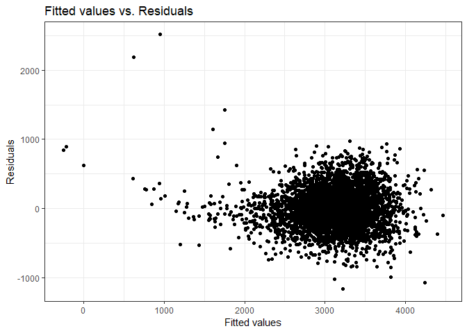

P8105 Homework 6
================
Adina Zhang

Problem 1. **Washington Post** Dataset
--------------------------------------

#### Load and clean dataset

``` r
# Pull dataset from web and convert it to readable format in R
# Create city_state variable that combines city and state
# Omit cities that don't report victim race
# Create binary variable to classify homicides solved and unsolved
# Recode victim_race to white vs. non-white
# Convert victim_age into a numeric
homicide_df = read_csv(url("https://raw.githubusercontent.com/washingtonpost/data-homicides/master/homicide-data.csv")) %>% 
  unite(city_state, city:state, sep = ", ") %>% 
  filter(!city_state %in% c("Dallas, TX", "Phoenix, AZ", "Kansas City, MO", "Tulsa, AL")) %>%
  mutate(resolved = as.numeric(disposition == "Closed by arrest"),
         victim_race = as.factor(if_else(victim_race == "White", "White", "Non-white")),
         victim_race = fct_relevel(victim_race, "White"),
         victim_age = as.numeric(victim_age))
```

#### Fit logistic regression model for Baltimore, MD

``` r
# Filter to Baltimore, MD
baltimore_df = homicide_df %>% 
  filter(city_state == "Baltimore, MD")

# Fit regression with resolved as outcome and age, sex, and race as predictors
baltimore_glm = baltimore_df %>% 
  glm(resolved ~ victim_age + victim_race + victim_sex, data = ., family = binomial())

# Tidy and summarize logistic regression outcomes
baltimore_glm %>% 
  broom::tidy() %>% 
  mutate(OR = exp(estimate),
         conf.low = exp(estimate - 1.96 * std.error),
         conf.high = exp(estimate + 1.96 * std.error)) %>% 
  select(term, log_OR = estimate, OR, conf.low, conf.high) %>% 
  filter(term == "victim_raceNon-white") %>% 
  knitr::kable(digits = 3)
```

| term                  |  log\_OR|     OR|  conf.low|  conf.high|
|:----------------------|--------:|------:|---------:|----------:|
| victim\_raceNon-white |    -0.82|  0.441|     0.313|       0.62|

Compared to white victims, non-white victims in Baltimore, MD have a 0.441 odds of having resolved homicides between 2010 and 2016. We are 95% confident that the true odds ratio of resolved homicides for non-white victims is between 0.312 and 0.62.

#### Fit linear model across each city

``` r
# Nest dataset by city_state in order to apply glm across each city_state
# Unnest and create a dataframe that includes estimated odds ratio and confidence intervals
# Only include ORs and CIs for comparing white vs. non-white victims
homicide_glm = homicide_df %>% 
  group_by(city_state) %>% 
  nest() %>% 
  mutate(models = map(data, ~glm(resolved ~ victim_age + victim_race + victim_sex, data = ., family = binomial())),
         models = map(models, broom::tidy)) %>% 
  select(-data) %>% 
  unnest() %>% 
  mutate(OR = exp(estimate),
         conf.low = exp(estimate - 1.96 * std.error),
         conf.high = exp(estimate + 1.96 * std.error)) %>% 
  filter(term == "victim_raceNon-white")
```

#### Plot ORs and CIs across each city

``` r
# Plot estimated ORs and CIs across each city
homicide_glm %>% 
  mutate(city_state = fct_reorder(city_state, OR)) %>% 
  ggplot(aes(x = city_state, y = OR)) + 
  geom_point() + 
  geom_errorbar(aes(ymin = conf.low, ymax = conf.high)) +
  labs(
    title = "Estimated odds ratios of solving homicides, comparing non-white to white victims",
    x = "Location (City, State)",
    y = "Estimated Odds Ratio"
  ) + 
  theme_bw() + 
  theme(axis.text.x = element_text(angle = 90, hjust = 1))
```


Overall, most cities have a low estimated odds ratio when comparing solved homicides between non-white and white victims. Most odds ratios are below 1, indicating that the odds of having a solved homicide for non-white victims is lower than it is for white victims. The lowest odds ratios occur in Oakland, CA, Omaha, NE, and Boston, MA ([link](https://apps.bostonglobe.com/spotlight/boston-racism-image-reality/) to Boston Globe's report, is Boston racist?). However, there are a few cities that do not see much different between between non-white and white victims. Some of these include San Bernardino, CA, Durham, NC, Birmingham, AL, and Tampa, FL. These cities have estimated odds ratio near or even above 1. It should also be noted that these cities have wide confidence intervals which indicates large variability in the dataset and the true odds ratio could be much lower or higher than the one estimated.

Problem 2: Birthweight dataset
------------------------------

#### Load and clean dataset

``` r
birthweight_df = read_csv("./birthweight.csv") %>% 
  mutate(babysex = as.factor(babysex),
         frace = as.factor(frace),
         mrace = as.factor(mrace),
         malform = as.factor(malform)) %>% 
  select(-pnumlbw, -pnumsga)
```

#### Build a model to predict birthweight and fit to linear regression

``` r
# Select initial variables based off of highest correlation to birthweight
birthweight_df %>% 
  select(bwt, bhead, blength, delwt, gaweeks, mrace, wtgain) %>% 
  mutate(mrace = as.numeric(mrace)) %>% 
  cor() %>% 
  knitr::kable()
```

|         |         bwt|       bhead|     blength|       delwt|     gaweeks|       mrace|      wtgain|
|---------|-----------:|-----------:|-----------:|-----------:|-----------:|-----------:|-----------:|
| bwt     |   1.0000000|   0.7471068|   0.7434508|   0.2878893|   0.4121833|  -0.2076689|   0.2472526|
| bhead   |   0.7471068|   1.0000000|   0.6304548|   0.2143707|   0.3784565|  -0.1101420|   0.1833337|
| blength |   0.7434508|   0.6304548|   1.0000000|   0.2291494|   0.3592637|  -0.1324835|   0.1912238|
| delwt   |   0.2878893|   0.2143707|   0.2291494|   1.0000000|   0.1242785|  -0.0922383|   0.4247883|
| gaweeks |   0.4121833|   0.3784565|   0.3592637|   0.1242785|   1.0000000|  -0.1315206|   0.1481460|
| mrace   |  -0.2076689|  -0.1101420|  -0.1324835|  -0.0922383|  -0.1315206|   1.0000000|  -0.0319667|
| wtgain  |   0.2472526|   0.1833337|   0.1912238|   0.4247883|   0.1481460|  -0.0319667|   1.0000000|

``` r
fit1 = lm(bwt ~ bhead + blength + delwt + gaweeks + mrace + wtgain,
              data = birthweight_df)
summary(fit1) %>% broom::tidy()
```

    ## # A tibble: 9 x 5
    ##   term        estimate std.error statistic   p.value
    ##   <chr>          <dbl>     <dbl>     <dbl>     <dbl>
    ## 1 (Intercept) -5787.      97.9      -59.1  0.       
    ## 2 bhead         131.       3.44      38.1  8.31e-275
    ## 3 blength        76.5      2.03      37.7  1.05e-269
    ## 4 delwt           1.70     0.214      7.97 1.99e- 15
    ## 5 gaweeks        11.3      1.47       7.73 1.29e- 14
    ## 6 mrace2       -128.       8.96     -14.3  3.74e- 45
    ## 7 mrace3        -59.5     42.7       -1.39 1.63e-  1
    ## 8 mrace4       -104.      18.8       -5.55 3.05e-  8
    ## 9 wtgain          2.32     0.426      5.43 5.90e-  8

``` r
step1 <- update(fit1, . ~ . -mrace)
summary(step1) %>% broom::tidy()
```

    ## # A tibble: 6 x 5
    ##   term        estimate std.error statistic   p.value
    ##   <chr>          <dbl>     <dbl>     <dbl>     <dbl>
    ## 1 (Intercept) -6174.      96.3      -64.1  0.       
    ## 2 bhead         135.       3.49      38.7  1.51e-281
    ## 3 blength        78.7      2.07      38.0  3.32e-273
    ## 4 delwt           1.61     0.216      7.46 1.01e- 13
    ## 5 gaweeks        13.7      1.49       9.18 6.28e- 20
    ## 6 wtgain          2.18     0.436      5.00 6.04e-  7

``` r
step2 <- update(step1, . ~ . -wtgain)
summary(step2) %>% broom::tidy()
```

    ## # A tibble: 5 x 5
    ##   term        estimate std.error statistic   p.value
    ##   <chr>          <dbl>     <dbl>     <dbl>     <dbl>
    ## 1 (Intercept) -6250.      95.4      -65.5  0.       
    ## 2 bhead         136.       3.50      38.8  1.00e-282
    ## 3 blength        79.1      2.07      38.2  5.23e-275
    ## 4 delwt           2.04     0.199     10.2  2.79e- 24
    ## 5 gaweeks        14.2      1.49       9.51 3.15e- 21

My final model includes only birth length, baby's head circumference at birth, delivery weight and gestational age.

``` r
fit1 = lm(bwt ~ blength + bhead + gaweeks + delwt, data = birthweight_df)
summary(fit1)
```

    ## 
    ## Call:
    ## lm(formula = bwt ~ blength + bhead + gaweeks + delwt, data = birthweight_df)
    ## 
    ## Residuals:
    ##      Min       1Q   Median       3Q      Max 
    ## -1155.18  -183.25    -9.65   176.21  2513.16 
    ## 
    ## Coefficients:
    ##               Estimate Std. Error t value Pr(>|t|)    
    ## (Intercept) -6249.5265    95.3679 -65.531   <2e-16 ***
    ## blength        79.1451     2.0739  38.162   <2e-16 ***
    ## bhead         135.8153     3.5021  38.781   <2e-16 ***
    ## gaweeks        14.1812     1.4916   9.507   <2e-16 ***
    ## delwt           2.0402     0.1995  10.228   <2e-16 ***
    ## ---
    ## Signif. codes:  0 '***' 0.001 '**' 0.01 '*' 0.05 '.' 0.1 ' ' 1
    ## 
    ## Residual standard error: 282.8 on 4337 degrees of freedom
    ## Multiple R-squared:  0.6954, Adjusted R-squared:  0.6951 
    ## F-statistic:  2476 on 4 and 4337 DF,  p-value: < 2.2e-16

``` r
# Plot of model residuals against fitted values
birthweight_df %>% 
  add_residuals(fit1) %>% 
  add_predictions(fit1) %>% 
  ggplot(aes(x = pred, y = resid)) + 
  geom_point() + 
  labs(
    title = "Fitted values vs. Residuals",
    x = "Fitted values", 
    y = "Residuals"
  ) + 
  theme_bw()
```



#### Compare to other models

``` r
# Fit a second model using birth length and gestational age as predictors
fit2 = lm(bwt ~ blength + gaweeks, data = birthweight_df) 

# Fit a third model using head circumference, length, sex, and all interactions between these variables
fit3 = lm(bwt ~ bhead + blength + babysex + bhead*blength + bhead*babysex + blength*babysex,
          data = birthweight_df)
```
