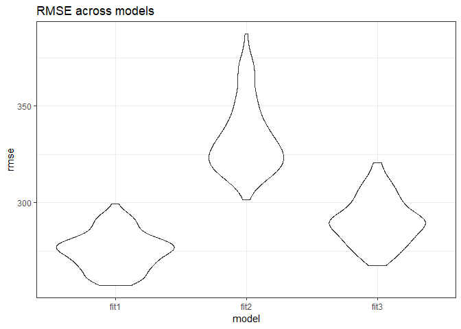

P8105 Homework 6
================
Adina Zhang

Problem 1. **Washington Post** Dataset
--------------------------------------

#### Load and clean dataset

``` r
# Pull dataset from web and convert it to readable format in R
# Create city_state variable that combines city and state
# Omit cities that don't report victim race
# Create binary variable to classify homicides solved and unsolved
# Recode victim_race to white vs. non-white
# Convert victim_age into a numeric
homicide_df = read_csv(url("https://raw.githubusercontent.com/washingtonpost/data-homicides/master/homicide-data.csv")) %>% 
  unite(city_state, city:state, sep = ", ") %>% 
  filter(!city_state %in% c("Dallas, TX", "Phoenix, AZ", "Kansas City, MO", "Tulsa, AL")) %>%
  mutate(resolved = as.numeric(disposition == "Closed by arrest"),
         victim_race = as.factor(if_else(victim_race == "White", "White", "Non-white")),
         victim_race = fct_relevel(victim_race, "White"),
         victim_age = as.numeric(victim_age))
```

#### Fit logistic regression model for Baltimore, MD

``` r
# Filter to Baltimore, MD
baltimore_df = homicide_df %>% 
  filter(city_state == "Baltimore, MD")

# Fit regression with resolved as outcome and age, sex, and race as predictors
baltimore_glm = baltimore_df %>% 
  glm(resolved ~ victim_age + victim_race + victim_sex, data = ., family = binomial())

# Tidy and summarize logistic regression outcomes
baltimore_glm %>% 
  broom::tidy() %>% 
  mutate(OR = exp(estimate),
         conf.low = exp(estimate - 1.96 * std.error),
         conf.high = exp(estimate + 1.96 * std.error)) %>% 
  select(term, log_OR = estimate, OR, conf.low, conf.high) %>% 
  filter(term == "victim_raceNon-white") %>% 
  knitr::kable(digits = 3)
```

| term                  |  log\_OR|     OR|  conf.low|  conf.high|
|:----------------------|--------:|------:|---------:|----------:|
| victim\_raceNon-white |    -0.82|  0.441|     0.313|       0.62|

Compared to white victims, non-white victims in Baltimore, MD have a 0.441 odds of having resolved homicides between 2010 and 2016. We are 95% confident that the true odds ratio of resolved homicides for non-white victims is between 0.312 and 0.62.

#### Fit linear model across each city

``` r
# Nest dataset by city_state in order to apply glm across each city_state
# Unnest and create a dataframe that includes estimated odds ratio and confidence intervals
# Only include ORs and CIs for comparing white vs. non-white victims
homicide_glm = homicide_df %>% 
  group_by(city_state) %>% 
  nest() %>% 
  mutate(models = map(data, ~glm(resolved ~ victim_age + victim_race + victim_sex, data = ., family = binomial())),
         models = map(models, broom::tidy)) %>% 
  select(-data) %>% 
  unnest() %>% 
  mutate(OR = exp(estimate),
         conf.low = exp(estimate - 1.96 * std.error),
         conf.high = exp(estimate + 1.96 * std.error)) %>% 
  filter(term == "victim_raceNon-white")
```

#### Plot ORs and CIs across each city

``` r
# Plot estimated ORs and CIs across each city
homicide_glm %>% 
  mutate(city_state = fct_reorder(city_state, OR)) %>% 
  ggplot(aes(x = city_state, y = OR)) + 
  geom_point() + 
  geom_errorbar(aes(ymin = conf.low, ymax = conf.high)) +
  labs(
    title = "Estimated odds ratios of solving homicides, comparing non-white to white victims",
    x = "Location (City, State)",
    y = "Estimated Odds Ratio"
  ) + 
  theme_bw() + 
  theme(axis.text.x = element_text(angle = 90, hjust = 1))
```


Overall, most cities have a low estimated odds ratio when comparing solved homicides between non-white and white victims. Most odds ratios are below 1, indicating that the odds of having a solved homicide for non-white victims is lower than it is for white victims. The lowest odds ratios occur in Oakland, CA, Omaha, NE, and Boston, MA ([link](https://apps.bostonglobe.com/spotlight/boston-racism-image-reality/) to Boston Globe's report, is Boston racist?). However, there are a few cities that do not see much different between between non-white and white victims. Some of these include San Bernardino, CA, Durham, NC, Birmingham, AL, and Tampa, FL. These cities have estimated odds ratio near or even above 1. It should also be noted that these cities have wide confidence intervals which indicates large variability in the dataset and the true odds ratio could be much lower or higher than the one estimated.

Problem 2: Birthweight dataset
------------------------------

#### Load and clean dataset

``` r
birthweight_df = read_csv("./birthweight.csv") %>% 
  mutate(babysex = as.factor(babysex),
         frace = as.factor(frace),
         mrace = as.factor(mrace),
         malform = as.factor(malform)) %>% 
  select(-pnumlbw, -pnumsga)
```

#### Build a model to predict birthweight and fit to linear regression

Using the built-in correlation function, I narrowed down the predictors to six predictors which had the largest correlations with birthweight. These are shown in the table below. I chose correlations which were greater than 0.20. Just to ensure these predictors were significant, I fit the predictors through regression. Each p-value (except for mrace at level 3) was significant at *α* = 0.001 level. Therefore, my final model includes birth length, circumference of head at birth, gestational age, delivery weight of the mother, weight gain of the mother, and mother's race.

``` r
# Select initial variables based off of highest correlation to birthweight
birthweight_df %>% 
  select(bwt, bhead, blength, gaweeks, delwt, wtgain, mrace) %>% 
  mutate(mrace = as.numeric(mrace)) %>% 
  cor() %>% 
  knitr::kable()
```

|         |         bwt|       bhead|     blength|     gaweeks|       delwt|      wtgain|       mrace|
|---------|-----------:|-----------:|-----------:|-----------:|-----------:|-----------:|-----------:|
| bwt     |   1.0000000|   0.7471068|   0.7434508|   0.4121833|   0.2878893|   0.2472526|  -0.2076689|
| bhead   |   0.7471068|   1.0000000|   0.6304548|   0.3784565|   0.2143707|   0.1833337|  -0.1101420|
| blength |   0.7434508|   0.6304548|   1.0000000|   0.3592637|   0.2291494|   0.1912238|  -0.1324835|
| gaweeks |   0.4121833|   0.3784565|   0.3592637|   1.0000000|   0.1242785|   0.1481460|  -0.1315206|
| delwt   |   0.2878893|   0.2143707|   0.2291494|   0.1242785|   1.0000000|   0.4247883|  -0.0922383|
| wtgain  |   0.2472526|   0.1833337|   0.1912238|   0.1481460|   0.4247883|   1.0000000|  -0.0319667|
| mrace   |  -0.2076689|  -0.1101420|  -0.1324835|  -0.1315206|  -0.0922383|  -0.0319667|   1.0000000|

``` r
# Fit regression model
mult.fit = lm(bwt ~ bhead + blength + gaweeks + delwt + wtgain + mrace, 
              data = birthweight_df)
summary(mult.fit)
```

    ## 
    ## Call:
    ## lm(formula = bwt ~ bhead + blength + gaweeks + delwt + wtgain + 
    ##     mrace, data = birthweight_df)
    ## 
    ## Residuals:
    ##      Min       1Q   Median       3Q      Max 
    ## -1082.99  -184.20    -1.34   177.71  2402.85 
    ## 
    ## Coefficients:
    ##               Estimate Std. Error t value Pr(>|t|)    
    ## (Intercept) -5787.2530    97.8604 -59.138  < 2e-16 ***
    ## bhead         131.0614     3.4356  38.148  < 2e-16 ***
    ## blength        76.5379     2.0282  37.736  < 2e-16 ***
    ## gaweeks        11.3347     1.4657   7.734 1.29e-14 ***
    ## delwt           1.7044     0.2138   7.971 1.99e-15 ***
    ## wtgain          2.3151     0.4263   5.431 5.90e-08 ***
    ## mrace2       -127.7564     8.9558 -14.265  < 2e-16 ***
    ## mrace3        -59.4948    42.6652  -1.394    0.163    
    ## mrace4       -104.2004    18.7802  -5.548 3.05e-08 ***
    ## ---
    ## Signif. codes:  0 '***' 0.001 '**' 0.01 '*' 0.05 '.' 0.1 ' ' 1
    ## 
    ## Residual standard error: 275.5 on 4333 degrees of freedom
    ## Multiple R-squared:  0.7111, Adjusted R-squared:  0.7106 
    ## F-statistic:  1333 on 8 and 4333 DF,  p-value: < 2.2e-16

``` r
# Plot of model residuals against fitted values
birthweight_df %>% 
  add_residuals(mult.fit) %>% 
  add_predictions(mult.fit) %>% 
  ggplot(aes(x = pred, y = resid)) + 
  geom_point() + 
  labs(
    title = "Fitted values vs. Residuals",
    x = "Fitted values", 
    y = "Residuals"
  ) + 
  theme_bw()
```


Using my regression model, most point are evenly distributed around the residuals = 0 line. However, there are a handful of outliers towards the left of the cluster showing a few fitted values with large residuals.

#### Compare to other models

Model 1: A model with parameters that were determined in the previous part (my model).
Model 2: A model using birth length and gestational age as predictors.
Model 3: A model using head circumference, length, sex, and all interactions between these three variables.

``` r
# Create training and testing dataframes 
set.seed(1)

cv_df =
  crossv_mc(birthweight_df, 100) %>% 
  mutate(train = map(train, as_tibble),
         test = map(test, as_tibble))

# Cross validation of three models
# Run regressions across training dataframes
# Apply regression models to testing dataframes
cv_df = 
  cv_df %>% 
  mutate(model_1 = map(train, ~lm(bwt ~ bhead + blength + gaweeks + delwt + wtgain + mrace, 
                                  data = birthweight_df)),
         model_2 = map(train, ~lm(bwt ~ blength + gaweeks, data = .x)),
         model_3 = map(train, ~lm(bwt ~ bhead + blength + babysex + 
                                 bhead*blength + bhead*babysex + blength*babysex,
                               data = .x))) %>% 
  mutate(rmse_fit1 = map2_dbl(model_1, test, ~rmse(model = .x, data = .y)),
         rmse_fit2 = map2_dbl(model_2, test, ~rmse(model = .x, data = .y)),
         rmse_fit3 = map2_dbl(model_3, test, ~rmse(model = .x, data = .y)))
```

Plot RMSE violin plots
----------------------

``` r
# Violin plots of RMSE for each model
cv_df %>% 
  select(starts_with("rmse")) %>% 
  gather(key = model, value = rmse) %>% 
  mutate(model = str_replace(model, "rmse_", ""),
         model = fct_inorder(model)) %>% 
  ggplot(aes(x = model, y = rmse)) + 
  geom_violin() + 
  labs(
    title = "RMSE across models"
  ) +
  theme_bw()
```



Based off of the above plot, the distribution of RMSE for my model fits the best. In my model (fit1), the distribution of the RMSE through each cross-validation iteration is much lower than model 2 and slightly lower than model 3.
